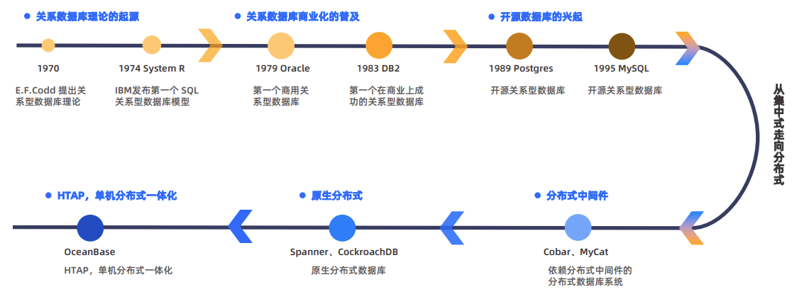

# 完整笔记

## 一、产品概述（6%）

### 数据库的发展与演进



经历了从集中到分布式的形态变化，出现了云原生数据库这一产品形态

传统集中式数据库面临的挑战

- 依托高端硬件，成本高昂
- 只能依靠提升设备自身性能进行容量提升，无法横向扩容

使用数据库中间件的分库分表方案存在的短板

- 数据库核心引擎没有分布式能力，所依赖的中间件难以做到RPO=0，不能保证百分百的ACID
- 数据库服务器的时间戳不一致，难以保证数据版本号的全局一致性
- 扩容和缩容时，底层引擎无法在线调整数据分布规则
- 跨库的复杂运算只能在中间件完成，而中间件不具备分布式并行计算能力，最终限制性能，产生业务侵入性

原生的分布式关系型数据库架构

- 实现Paxos，保证RPO和RTO，保证全局一致性
- 可线性扩容
- 对业务透明
- 无需高端硬件，成本低

### OceanBase数据库

第三代原生分布式通用型数据库

|  |  | 产品 | 优点 | 劣势 |
| --- | --- | --- | --- | --- |
| 第一代 | 非关系型 | BigTable | 支持高可用、高扩展 | 仅支持单行事务，一致性不好 |
| 第二代 | 关系型 | Spanner | 支持全功能事务，保证强一致性 | 牺牲单机性能，不兼容SQL标准 |
| 第三代 | 关系型 | OceanBase | 支持标准SQL，单机分布式一体化 |  |

> HTAP（Hybrid Transaction/Analytical Processing）是一种混合负载数据库架构，能够同时处理事务性请求（OLTP）和分析型查询（OLAP）。这种架构的优势在于，它可以在同一数据库中高效地处理高并发的事务操作和复杂的分析查询。
> 

OceanBase迭代

- 1.0：分布式引擎
- 2.0：原生分布式数据库
- 3.0：HTAP混合引擎
- 4.0：一体化架构、多云部署

### OceanBase产品与工具体系

产品三系：OceanBase社区版、OceanBase企业版、OBCloud云数据库

- 常用工具
    - 迁移评估工具 OMA
    - 在线迁移工具 OMS
    - 离线迁移工具 DataX 不支持增量同步和数据校验
    - 导数工具 OBDumper/OBLoader 用来导入导出
    - 开发者工具 ODC
    - 运维管理工具 OCP 提供对OceanBase集群的图形化管理能力
    - 诊断自治工具 OAS
    - 管理者工具 OAT 用于安装和管理OceanBase生态产品和组件的可视化平台

<aside>
💡

- 主节点故障的情况下，Paxos可以保证数据无损（即RPO=0)，服务恢复时间（RTO）在8秒以内
</aside>

## 二、集群架构（28%）

### 集群基本概念


> 集群→Zone→OB Server→划分为多个资源池→租给租户使用→库→表→分区→一个分区对应一个分片→一个日志流包含多个分片，一个日志流有多个副本，作为一个Paxos组
> 

OceanBase 的分布式数据库处理采用 Shared Nothing 架构，数据库内的 SQL 执行引擎具有分布式执行能力

- 集群：一个集群包含多个租户，由多个OBServer服务器协同提供服务
- OBserver：在服务器上运行的单进程程序，作为数据库的运行实例，使用本地的文件存储数据和事务redo日志
- Zone（可用区）：是一个逻辑概念，每个Zone有且仅有一份完整的副本。单机部署时zone的个数为1，分布式部署时zone个数≥2。配置仲裁服务时建议个数为2或4，没有仲裁服务时建议个数为奇数。少数派故障不影响业务。

分布式架构提供了更加灵活的在线扩展性

- 当集群的容灾需求发生变化，通过调整可用区数量的方式提高或降低集群的容灾能力
- 当集群的外部负载发生变化，通过调整可用区内物理区的数量改变负载能力

单集群多租户（tenant）设计，实现了资源隔离，支持公有云、私有云、混合云等多种部署形式|

> 租户是一个逻辑概念，可以创建自己的用户并进行独立的权限管理，有自己独立的系统变量和系统参数；兼容模式可选：oracle或mysql
> 

租户分类

- 系统租户：集群默认创建的用户，与集群的生命周期一致，负责管理集群和所有租户的生命周期；其数据是集群私有的，不支持主备集群物理同步和物理备份恢复
- 用户租户：由用户创建的租户，支持跨集群物理同步和物理备份恢复
- Meta租户：OceanBase数据库内部自管理的租户，每创建一个用户租户，系统就会自动创建一个对应的meta租户，其生命周期与用户租户保持一致。用于存储和管理用户租户的集群私有数据（不需要跨库物理同步和物理备份恢复）：配置项、位置信息、日志流状态等


OB Server 通过划分为资源单元（Unit）的形式，重新构成资源池，并分配给指定的一个租户

> 一个资源单元只能属于一个租户，一个租户在一个OB Server上只能同时存在一个资源单元
> 

资源池化，使得可以通过调节资源池中资源单元的规格大小和资源单元的数量实现在线的弹性扩缩容

- 水平扩缩容：调整 UNIT_NUM
- 垂直扩缩容：调整资源规格

**副本与角色**：分布式架构下，OB会把一份数据拷贝到多个机器，数据的拷贝称为副本。多个副本中，有且仅有一份接受**强一致性读和写操作**，称为主副本（Leader），其他副本仅支持弱一致性读操作，称为从副本（Follower）

**日志流**：OB通过在多个副本之间同步事务日志来完成副本的同步，不同副本之间同步的日志称为日志流。OB为一个租户在同一台OBS下的所有Leader分区写一份日志，并将这份日志在多个副本间同步，称为**单机日志流**

**Paxos协议**：日志流同步通过Paxos保证，事务日志需要在多数派个副本同步成功才算提交完成

**副本类型**：参与Paxos多数派同步的副本拥有完整的日志和数据，可以参与leader选举，称为**全功能副本**；还有一种，虽然也拥有完整的日志和数据，但不参与Paxos多数派同步，只能提供弱一致性读，称为**只读副本。**只有全功能副本有leader和follower的角色区分

### 路由与负载均衡

OB数据库采用专用的代理服务 OceanBase Database Proxy（ODP）。用户的数据以多副本的形式存放在各个OBS节点上，ODP接受用户发出的SQL请求，将其转发至最佳的目标OBS节点，然后将执行结果返回给用户


能力：

- 反向代理：对SQL进行解析，确定Leader所在机器，将请求路由对应到Leader
- 状态感知：自动屏蔽问题节点
- 高性能：轻量化处理，不做数据计算
- 高可用：每个Proxy是一个无状态的服务进程，不做数据持久化，Proxy之间无联系

**OBS节点间路由**

OBS节点既是计算节点，也是存储节点。收到SQL请求之后，调用分布式优化器进行解析，如果需要访问存储在其他节点上的数据，会将访问自动转发到对应节点，远程节点完成请求之后会将结果发送回源节点，最后将SQL执行结果返回给应用或ODP。


**Primary Zone**：租户可以设置primary zone，B会在PZ中分配leader副本。它是一个zone集合，以逗号分隔相同优先级，以分号分隔不同优先级

> 主副本会分布在第一级PZ
> 

**表组（Tablegroup）**：是一个逻辑概念，表示一组表的集合。默认情况下，不同表之间的数据随机分布，通过定义表组，可以控制一组表在物理存储上的邻近关系。

在V4.2之后，表组只需要定义SHARDING属性，就可以灵活地将不同分区方式的表加入

| SHARDING | 汇聚规则 | 分区要求 |
| --- | --- | --- |
| NONE | 所有表的所有分区聚集在同一台机器 | 无限制 |
| PARTITION | 一级分区号相同的聚集在同一台机器 | 表组内要么全是分区表，要么全是非分区表；如都是分区表，只要求一级分区的分区方式相同 |
| ADAPTIVE（自适应） | 如果都是非分区，如NONE；都是一级分区，如PARTITION；都是二级分区，则按每个一级分区下的二级分区打散，二级分区号相同的聚集在同一台机器 | 要求分区方式完全相同 |

**RootService总控服务**：OB核心模块，管理整个集群。提供资源管理、容灾、负载均衡、schema 管理等功能

采用多副本高可用架构，当RS所在机器故障时，其余 OBServer 会选举出来新的 RS

### 高可用部署架构


OB满足金融行业6级容灾标准，RPO=0，RTO<8s

| 种类 | 实现方案 | 备故障 | 主故障 |
| --- | --- | --- | --- |
| 传统数据库 | 主库+备库 | 从最大保护模式切换到最大性能模式，即Redo-Log采用异步同步模式 | 备机不能自动切换为主（避免出现两个主的脑裂情况），需要人工将备机变为主机 |
| OB | Paxos保证数据强一致 | 主副本可以收到其他备副本的响
应，仍然满足多数派强一致 | 剩余副本可以自动选举出新的主，新的主自动接管业务 |

OB仲裁高可用：仲裁服务独立于OB集群部署，承载日志流级别的仲裁

- 仅参与Leader选举相关的投票，不存储日志和表数据，开销较低
- 开启仲裁服务时，RS自动为每个日志流成员添加一个仲裁副本
- 半数全功能副本故障时，仲裁提供自动降级服务（将故障节点踢出Paxos组）
- 仲裁方案在两个全功能副本的基础上利用极低的额外资源开销实现了无损双活能力

**故障场景下的自动Leader切换**

如果发生故障的节点小于半数，选举协议能够保证自动恢复，且 RPO = 0；如果多于半数的节点发生故障，就需要人工介入，可以通过单副本的方式拉起服务，由于少数派可能没有包含最新的数据，因此可能会丢失最后一部分数据

> Leader副本故障，会在Follower中选出新的Leader接管业务
> 

**故障场景下自动补副本**

当节点异常的时间超过永久下线的时间阈值，OB会将异常节点上的副本从Paxos组中剔除，并自动尝试在同Zone内有充足资源的其他节点上进行补副本的操作


**容灾部署一：同城双中心主备库**

> 在同城的两个机房部署两套可提供对外服务的集群，两个集群中的租户互为主备，实现同城双活和灾备
> 
- 每个机房部署一个独立的三副本集群，每个集群的三个副本组成独立的Paxos组。两个集群中的租户互为主备，均可对外提供服务
- 任一集群发生少数派故障时，剩余的副本依然是多数派，依然可以同步Redo-Log日志，保证 RPO=0
- 任一集群发生多数派故障时，可以通过主备切换让另一集群来接管业务

**容灾部署二：同城三中心仲裁高可用**

同城第三机房部署仲裁服务


 **容灾部署三：两地三中心主备库方案**

一个城市的两个机房为主中心，共同提供业务服务；另一个城市的一个机房为备中心，承载第五副本与备集群，RPO≈0

任何 IDC 的故障，最多损失 2 份副本，剩余的 3 份副本依然满足多数派。备城市同时部署备集群，使用异步同步模式与主集群同步数据。当主城发生城市级故障时，可以切换到备集群继续提供服务（无法做到RPO=0）


**容灾部署四：三地五中心仲裁高可用**

两个主城市的四个机房为主中心，共同提供业务服务；另一个城市的第五机房部署仲
裁服务，降低硬件成本。


<aside>
💡

课后题：

- Zone 是一个逻辑概念，一个 Zone 内的所有 OBServer 共同承载一份完整的副本。（ 正确 ）
- 一个 Zone 可以对应不同的城市，或者一个城市的不同机房，或者一个机房的不同机架。 （ 错误 ）
- OceanBase V4 以分区为单位进行数据管理和多副本间的日志同步。（ 错误 ）
- 在 OceanBase V4， 同一个日志流中的不同分区的 Leader 副本可以分布在不同的 OBServer 上。 （ 错误 ）
- 如果一个集群有3个 Zone，每个 Zone 有5台 OBServer。那么一个日志流最多有几份全功能副本呢？（ A ）
    
    A. 3 B. 5 C. 8 D. 15
    
- 如果一个集群有3个 Zone，每个 Zone 有5台 OBServer，其中一个租户的资源池的 Unit Num=3，则该集群有多少个服务器中有该租户的资源单元呢？ （ C ）
    
    A. 3 B. 5 C. 9 D. 15
    
- 关于 OceanBase V4的日志流副本，以下说法正确的是。（ AD ）
    
    A. 日志流副本通常有两种，分别是全功能型副本、只读型副本。
    
    B. 全功能型副本既可读也可写，只读型副本只能读，两种副本均支持强一致性读操作。
    
    C. Leader 副本既可读也可写，是全功能型副本；Follower 副本只能读，是只读型副本。
    
    D. 一个5副本的集群中，事务日志只需要3个副本强同步，不需要5个副本都强同步。
    
- 关于 OceanBase V4 的负载均衡机制，以下说法正确的是。（ BCD ）
    
    A. OceanBase 提供了人工干预负载均衡的方法，用户可以在创建Database、 Table、Partition 的时候指定其存放的OBServer节点位置。
    
    B. 用户可以使用表组（Tablegroup）来影响负载均衡，让业务上有关联关系的 Table、Partition 在物理分布上有亲和性，从而减少分布式的访问开销。
    
    C. OceanBase 有自动的负载均衡能力，可以将 Table、Partition 均匀地分散在 Zone 内的多个 OBServer 节点上。
    
    D. OceanBase 有自动的负载均衡能力，可以将 Leader 副本均匀地分散在指定的多个 Primary Zone 中 。
    
</aside>

## 三、底层部署（28%）


### SQL引擎

OB的同一个集群可以同时支持MySQL和Oracle两种兼容模式

> 社区版只提供MySQL
> 
- MySQL 模式下的数据库对象主要包括：表（Table）、视图（View）、索引（Index）、分区（Partition）、序列（Sequence）、触发器（Trigger）以及存储程序等。
- Oracle 模式下的数据库对象主要包括：表（Table）、视图（View）、索引（Index）、分区（Partition）、序列（Sequence）、同义词（Synonyms）、触发器（Trigger）以及各种 PL 对象（PL 子程序和包）等。

**库**

- MySQL 模式：Database
- Oracle 模式：Schema

**操作与定义**

- 全表扫描
- 索引扫描
    - OB支持全局索引、局部索引（每个分区中创建的索引）、空间索引（加速空间数据查询的特殊索引类型）
    - 索引的匹配规则
        - 最左匹配：联合索引中，只有最左的的键是等值查询时，后面的键才能参与匹配
        - 如果列的前缀能转化为范围，则索引也可以发挥作用
        - 如果查询语句需要进行排序，而排序顺序与索引一致，则可以避免排序
            
            
            
- 分区
    
    OB中同一个表的不同分区可以分布在不同的服务器节点上
    
    DDL语句可以操作分区
    
- 在分区表上创建索引
    - LOCAL 局部索引（分区索引）：针对单个分区上的数据创建的索引，其分区与对应表分区的物理位置一致，且Leader副本位置相同
        
        使用局部索引，查询条件中需要指定分区键来做分区裁剪，否则将会访问所有索引分区，影响性能
        
        
        
    - GLOBAL 全局索引：将所有主表分区的数据合成一个整体来建立全局索引，其分区规则跟表的分区规则是独立的，可以分区也可以不分区
        
        全局唯一索引可以保证表数据的全局唯一性
        
        
        
- **执行计划**：执行计划（Execution Plan）也叫访问路径（Access Path），描述了数据库执行查询时搜索匹配记录、运算查询结果的方法
    
    单表查询的常见执行计划有：全表扫描（ TABLE FULL SCAN ）、索引扫描（TABLE RANGE SCAN）、主键唯一查询（TABLE GET）
    
- **执行计划缓存**：对于执行频次较高且执行时间较短的 SQL，如果每次执行都生成执行计划，SQL 优化的耗时会严重拖累 SQL 性能。OB将生成的计划放进 Plan Cache，再次执行时直接从 Plan Cache 获取 Plan
    
    OB数据库的计划缓存中，SQL 的执行计划可以分为本地计划、远程计划和分布式计划三种类型。同一条 SQL 根据其需要访问的数据不同，可能同时具有三种执行计划
    
    - 缓存的刷新
        - n SQL 中涉及表的 Schema 变更时（比如添加索引、删除或增加列等）
        - SQL 中涉及重新收集表的统计信息时
    - 缓存的淘汰
        - 自动淘汰：当计划缓存占用的内存达到了内存上限时，对最久没被使用的执行计划执行自动淘汰
        - 手动淘汰：是指用命令强制将计划缓存中的计划进行删除

### 存储引擎

| 种类 | 存储方式 | 写数据 | 读数据 | 优点 | 缺点 |
| --- | --- | --- | --- | --- | --- |
| 传统数据库 | 堆文件组织 | 原地更新，先将数据写道 buffer pool，通过check point将脏数据刷新到硬盘 | 从 buffer pool 中读 | 数据只保留一份，查询性能好 | 存在随机写 |
| 新一代数据库 | LSMTree | 先将数据写到Mem，再利用转储将增量数据合并 | 从Cache中读 | 解决写的问题 | 读取的路径数量长 |

**动态数据：**MEMTABLE，LSMTree 架构中增量数据在写内存中的组织形式。插入/更新/删除数据时，数据被写入内存块，在 HashTable 和 BTree 中存储的均为指向对应数据的指针

**静态数据**：SSTABLE，LSMTree 架构中表数据在磁盘中的存储形式，由数据宏块和微块组成。

**数据落盘（转储）**：当 MemTable 的大小超过一定阈值时，就需要将 MemTable 中的数据转存到 SSTable 中以释放内存。采用顺序追加写入的方式，避免随机写和写放大，提升写入的性能。

> OceanBase 采用分层转储的策略：
L0层：从内存中转储生成的SSTable，称为L0层
L1层：当L0层的数据量达到阈值时，会自动将L0层的多个SSTable压缩成一个SSTable，称为L1层
L2层：将所有的动静态数据做归并，形成一个新的基线SSTable，称为L2层
> 

**数据合并**：合并会将动静态数据做归并，失效的多版本数据删除，生成按照主键排序的新的基线 SSTable，有利于提升查询的性能。可以通过自动触发、手动触发、定时触发

**数据压缩**：合并时OB会对 SSTable中的数据进行压缩和编码，来节省数据在硬盘上的存储空间，同时减小对 SSTable 进行查询时产生的 IO。

- 第一次压缩是编码压缩
- 第二次压缩是通用压缩

### 事务引擎

> 核心：全局时间戳、两阶段提交、一致性算法
> 

事务具有ACID特性

- 原子性
- 一致性
- 隔离性
- 持久性

> 原子性：账户A的扣款和账户B的入账必须全部成功或者全部回滚
一致性：转账交易前后，账户A和账户B的余额均处于逻辑一致
隔离性：在转账交易的事务没有提交前：通过锁机制，别人不能同时对账户A、B执行修改操作；通过隔离级别与MVCC机制，别人无法看到账户A、B未提交的余额变更
持久性：转账交易完成时，数据库通过WAL机制保证事务日志落盘，即使机器故障重启，数据库依然可以通过日志恢复出事务提交后的数据状态
> 

**并发控制**

- 隔离级别：用于描述事务并发执行时互相干扰的程度
    - 读已提交（Read Committed）：一个事务执行的查询，只能看到这次查询开始之前提交的数据。
    - 可串行化（Serializable）：一个事务的查询，只能看到事务开始之前提交的数据，看起来就像是串行执行的。这是最严格的隔离级别。
    - 可重复读（Repeatable Read）：事务内不同时间读到的同一批数据是一致的。仅MySQL 模式支持可重复读。
    - 读未提交（Read Uncommitted）:一个事务读到其他事务尚未提交的数据。OceanBase 不支持读未提交。
    
    
    

**锁**

OceanBase V4 版本实现了表锁和行锁两级锁。

**多版本并发控制（MVCC）**

> 太难不看
> 

**OceanBase 全局时间戳服务（GTS）**

每个租户都会启动一个GTS服务，事务在查询或修改的时候都会从此服务中获取版本号，保证所有的版本号**单调向前**且与真实世界的时间顺序保持一致

**两阶段提交（Two Phase Commit）**

将事务的提交分为准备阶段和提交阶段。事务由协调者（Coordinator）和参与者（Participant）组成，前者协调整个事务的执行，后则会指参与事务更新的数据库或节点

- 准备阶段：协调者向所有参与者发送准备请求，并等待他们的响应。参与者在这个阶段需要将操作结果记录在事务日志中，但并不提交事务
- 提交阶段：当所有参与者都准备好，协调者会向所有参与者发送提交请求。接收到提交请求的参与者会将记录在事务日志中的操作结果正式提交，并释放事务资源

**分布式事务引擎：采用多副本复制和一致性算法来实现分布式环境下的ACID事务特性**

事务分类

- 单日志流事务：只涉及一个日志流，并且这个日志流的leader与事务Session位于一台Server上
- 分布式事务：事务操作涉及的数据分布在多个日志流（Log Stream）上，或者即使只涉及一个日志流，但其leader与事务Session不在同一台Server上
- 是由多个数据库资源管理器参与执行的全局事务

<aside>
💡

课后习题

- 在OceanBase数据库中，转储时会将增量数据与静态数据合并在一起，形成一份完整的SSTable。（ 错误 ）
    
    > 这个动作是合并
    > 
- OceanBase数据库通过哪些机制来控制事务的并发执行？ （ BCD ）
    
    A. 一致性算法 B. MVCC C. 隔离级别 D. 锁
    
- 相比集中式数据库，以下哪项是分布式架构下事务处理的挑战？ （ ABCD ）
    
    A. 网络通信的不可靠 B. 节点故障的影响 C. 数据一致性的挑战 D. 性能下降
    
</aside>

## 四、安装部署（12%）

### 部署形态介绍


企业版建议使用OCP或者命令行部署，社区版可以通过OBD或者容器化部署

无论是社区版还是企业版，都既支持单机部署，也支持集群部署

**生产环境服务器要求：**至少由三个节点组成，每个节点对应一个 OBSERVER 进程，不同节点上的多个 OBSERVER 进程组成一个集群对外提供服务

生产环境仲裁服务器配置要求：最小规格机器（2C4G）默认可支持 32 个用户租户和 sys 租户同时开启仲裁

### 资源配置要求

- 单机集中式部署：仅包含一个 Zone 并且 Zone 中只有一个 OBServer 节点
- 集群高可用部署：同城三机房部署

### 单机部署

[部署OCP社区版（图形界面）或 部署OBD（命令行/图形界面）]→部署OB社区版→创建租户→连接使用

### 集群部署

在服务器上会运行叫做 observer 的单进程程序作为数据库的运行实例，使用本地的文件存储数据和事务 Redo 日志

集群部署需要配置可用区（Zone），由若干个服务器组成

服务器配置→部署OAT→通过OAT配置部署环境→使用OAT部署OCP→使用OCP部署OB集群→使用OCP部署OBProxy

### 验证与使用

功能测试环境下最低配置为，企业版：CPU：4 核，内存：16 GB；社区版：CPU：2 核，内存：6 GB

<aside>
💡

- OceanBase 数据库提供企业版和社区版两种形态，其中社区版只能进行单机集中式部署。（ 错误）
- 在不同的环境下，OceanBase 数据库有多种部署方式，对于企业版和社区版的部署方式，以下说法错误的是（ C ）
    
    A、企业版建议使用 OCP 部署 OceanBase 集群；
    
    B、企业版可以使用命令行部署 OceanBase 集群；
    
    C、社区版不可以使用OCP部署 OceanBase 集群；
    
    D、社区版可以使用 OBD 部署 OceanBase 集群。
    
- OceanBase社区版和企业版支持在windows下部署（ 错误？ ）
- OBD可以部署OceanBase企业版和社区版（ 错误 ）
</aside>

## 五、应用开发（18%）

### 开发工具

**连接方式**

- mysql：命令行客户端
- OBClient：命令行用户界面，支持mysql和oracle租户
- ODC：开发者中心

**驱动程序**

- Java: MySQL Connector/J（MySQL官方提供JDBC驱动）、OceanBase Connector（支持MySQL和Oracle）
- C: OceanBase Connector/C
- Python: PyMySQL

### 数据库对象设计


- 租户设计：SQL引擎支持MySQL和Oracle兼容模式，DBA由原来维护“多个数据库产品”变为维护一个“统一的数据库产品”。租户创建后类型无法修改
- 表设计：推荐使用VARCHAR；当表中的数据量很大，建议对表进行分区
- 分区设计：
    
    
    
    键的选择
    
    - hash 分区：选择区分度较大、在查询条件中出现频率最高的字段作为 hash 分区的分区键
    - range 和 list 分区：根据业务规则选择合适的字段作为分区键，但分区数量不宜过少
- 表组设计：SHARDING 的设计见前文
    
    ```jsx
    CREATE TABLEGROUP tblgroup1 SHARDING = 'NONE';
    CREATE TABLEGROUP tblgroup2 SHARDING = 'PARTITION'; 
    CREATE TABLEGROUP tblgroup3 SHARDING = 'ADAPTIVE';
    ```
    
- 索引设计
    
    建议以满足以下特征的列作为索引
    
    - 最频繁查询的列
    - 选择性高的列
    - 排序和分组列
    
    创建索引的原则
    
    - 覆盖索引：尽可能利用包含所有必要数据的索引，避免访问表数据
    - 等值优先：对于组合索引，建议将等值条件的列放在最前面
    - 避免对频繁更新的列进行索引
    - 限制索引的数量
    
    OB主键的特征
    
    - 非空且唯一
    - 全局唯一：故分区表的主键必须包含分区键
    - 数量唯一
    - 主键即表：不会为主键单独创建一个索引
        
        ```jsx
        CREATE TABLE students (
        S_ID BIGINT NOT NULL,
        S_Name VARCHAR(50) NOT NULL,
        Sex CHAR(1),
        Age INT,
        CS_ID INT NOT NULL,
        PRIMARY KEY (S_ID)
        ) partition by hash (S_ID) partitions 6;
        ```
        
    
    唯一索引的特征
    
    - 允许空值且唯一
    - 全局唯一
    - 约束即索引
        
        ```jsx
        CREATE UNIQUE INDEX students_ix2 
        ON students(s_name,s_id)
        LOCAL;
        ```
        
        ```jsx
        CREATE UNIQUE INDEX students_ix1 
        ON students(s_name)
        GLOBAL;
        ```
        
    
    ```jsx
    -- 全局唯一索引
    CREATE UNIQUE INDEX global_uniq_idx ON t1(col1) GLOBAL;
    
    -- 局部唯一索引
    CREATE UNIQUE INDEX local_uniq_idx ON t1(col2) LOCAL;
    
    -- 全局非唯一索引
    CREATE INDEX global_idx ON t1(col3) GLOBAL;
    
    -- 局部非唯一索引
    CREATE INDEX local_idx ON t1(col4) LOCAL;
    ```
    
- 视图设计
    
    ```jsx
    create_view_stmt:
    CREATE [OR REPLACE] VIEW view_name 
    [(column_name_list)] AS select_stmt 
    [WHERE condition WITH {LOCAL | CASCADED} 
    CHECK OPTION];
    ```
    
- 序列（Sequence）：是数据库按照一定规则生成的自增数字序列号，通常是一组间隔的数值（为数字类型）
    
    ```jsx
    CREATE SEQUENCE [IF NOT EXISTS] 
    [database_name.]sequence_name
    [MINVALUE int_value | NOMINVALUE]
    [MAXVALUE int_value | NOMAXVALUE]
    [START WITH int_value]
    [INCREMENT BY int_value]
    [CACHE int_value | NOCACHE]
    [ORDER | NOORDER]
    [CYCLE | NOCYCLE];
    ```
    
- 存储过程（Procedure）：SQL 语句和可选控制流语句的预编译集合

### DML/DQL语句

- insert
- update
- delete
- select
- join

### SQL调优

识别慢查询

- OceanBase 数据库使用 OCP 监控或 GV$OB_SQL_AUDIT 来定位慢查询，不管这些SQL是成功还是失败
- 发现慢查询后，我们可以使用 EXPLAIN 命令来查看查询语句的执行计划
    
    > EXPLAIN BASIC：用于最基本的计划展示，例如算子名称、所访问的表和索引名，以及过滤信息（Filter）等。BASIC 是默认的输出模式。
    EXPLAIN EXTENDED：用于最详细的计划展示，可以帮助你理解优化器的执行计划选择，从而解决 SQL 执行计划问题。
    > 

HINT：一种特殊的 SQL 注释

- 注释的左标记后紧跟着一个加号（+）时，表明其后为 Hint 的内容
- 一条语句只能包含一个 Hint 注释，并且该注释必须跟随 SELECT、UPDATE、INSERT、REPLACE 或 DELETE 关键字
- 如果服务器端无法识别 SQL 语句中的 Hint，那么优化器会选择忽略用户指定的 Hint 而使用默认计划所生成的执行逻辑。

> 在 SQL 语句中，表名存在别名即 table_name [AS] alias，必须写表别名，才能使 Hint 生效
> 

### 数据导入导出

数据导出方式包括：ODC导出、OBDUMPER、OUTFILE

- 导出结构和数据
- 仅导出数据
- 仅导出结构

工具：OBDUMPER

数据导入方式包括：ODC导入、OBLOADER、LOAD DATA（包括常规导入和旁路导入）、外表

- 导入结构和数据
- 仅导入数据
- 仅导入结构

ODC 目前支持批量导入 CSV 文件、 SQL 文件 和 ZIP 压缩文件

工具：OBLOADER

> OceanBase 数据库也支持旁路导入的方式向数据库插入数据，即 OceanBase 数据库支持向 data 文件中直接写入数据的功能。旁路导入可以绕过 SQL 层的接口，直接在 data 文件中直接分配空间并插入数据，从而提高数据导入的效率。
> 

<aside>
💡

【单选题】针对慢查询的优化，以下描述不正确的是___ C____？
A、通过 GV$OB_SQL_AUDIT 可以定位慢查询
B、GV$OB_SQL_AUDIT 中 elapsed_time，execute_time 以及 queue_time 分别代表总耗时,执行时间以及排队时间
C、通过 explain 查看的是真实的执行计划

</aside>

## 六、运维管理（8%）

### 运维体系及工具介绍


- DBA日常管理工作包括：数据库安装配置、数据库架构设计、容量规划管理、性能监控及调优、备份恢复管理、故障排查与应急响应
- OceanBase内核提供了视图、日志、PL/SQL、参数等功能作为数据库管理接口，借助以上功能及操作系统工具，形成 了OCP、OAS、WR、ASH、ob_admin等丰富的工具体系帮助日常运维管理和故障定位
- WR能够周期性的采集 OceanBase 数据库性能相关视图的数据，方便综合分析性能相关问题。而ASH通过分析活动会话的信息，形成更加详细的SQL、会话等分析报告，适用于短时间的性能抖动问题诊断
- OCP和OAS通过在主机安装Agent的方式采集OBServer、OBProxy、主机的相关数据，对其进行管
- 全链路追踪：Trace
- 系统视图：字典视图和性能视图
    
    
    

### 集群监控与管理

使用OCP对集群、OBProxy、主机进行监控与管理

- OCP可通过SSH接管主机并初始化主机，在主机上部署OCP Agent、OBProxy、OBServer，并对其进行全生命周期的管理
- OCP提供了租户创建、租户资源调整、租户资源隔离、租户数据库、租户用户权限、租户运行指标监测等租户管理功能
- OCP可通过集群或租户的参数管理页面对配置项或系统变量进行查看和修改
    
    > parameter与variable，配置项分为集群、Zone、机器和租户；系统变量分为租户的 Global 或 Session 级别。配置项分为动态和重启生效；Session系统变量只对当前会话有效，Global级系统变量对新连接会话有效
    > 

### 集群与租户扩缩容

### 容灾与高可用能力管理

### 实时诊断与SQL监控

事务状态

- 长事务（事务开始后，执行时间超过 60s 不提交的事务称为长事务）
- 悬挂事务（事务已经进入提交阶段，但是由于某种原因，导致事务无法提交成功，称为悬挂事务）
- 其他事务（除长事务及悬挂事务之外的为其他事务）。

### 告警与故障诊断

略

<aside>
💡

- 【单选题】以下哪一项不属于OceanBase数据库内核暴露的管理接口？（ D ）
    
    A.内置视图 B. 存储过程 C. SQL D.OCP
    
- 【多选题】通过OCP进行租户资源扩容，包括以下哪几项？（ AD ）
    
    A.调整Unit规格 B.添加主Zone C. 添加OBServer D.调整Unit数量
    
- 【多选题】通过OCP进行OceanBase数据库集群扩容，包括以下哪几项？（ AC ）
    
    A.添加Zone B.添加主机CPU C. 添加OBServer D.修改主Zone
    
- 【多选题】OCP Agent包括以下哪些进程？（ ABD ）
    
    A.ocp_agentd B.ocp_mgragent C. ocp_proxy D.ocp_monagent
    
- 【多选题】通过OCP可对主机进行哪些操作？（ ACD ）
    
    A.安装OCP Agent B.重启主机 C. 添加主机 D.删除主机
    
- 【多选题】通过OCP可对租户做哪些操作？（ ABCD ）
    
    A.创建主租户 B.调整租户资源 C. 锁定租户 D.创建备租户
    
</aside>